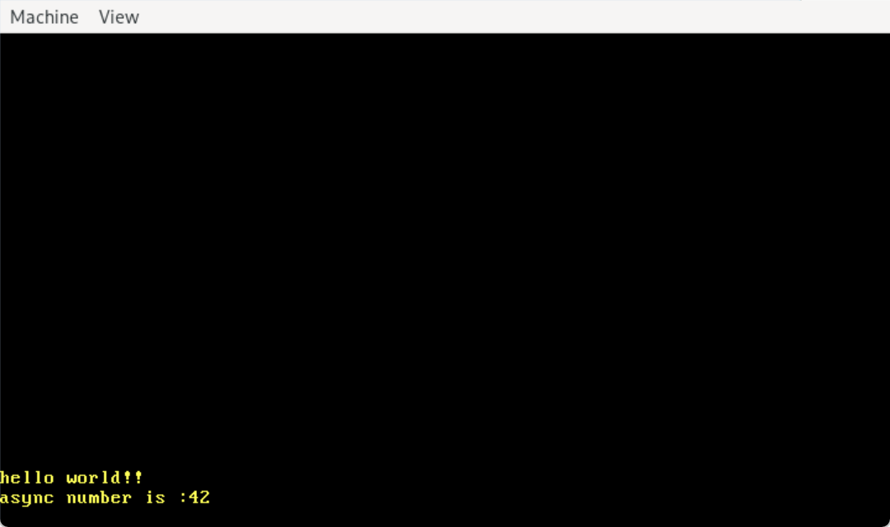

# Kevin OS


A minimalist operating system kernel written in Rust, following the [blog_os](https://os.phil-opp.com/) tutorial series.

## Features

- [x] Bare metal Rust environment
- [x] VGA text mode output
- [x] Interrupt handling
- [x] Memory management with paging
- [x] Heap allocation
- [x] Async/await support
- [x] Keyboard input handling
- [x] Multitasking

## Prerequisites

- Rust nightly toolchain
- QEMU for x86_64 architecture
- bootimage tool
- For WSL users: VcXsrv X Server

## Building and Running

```bash
# Build the kernel
cargo build

# Run in QEMU
cargo run
```

## WSL Setup Guide

For Windows Subsystem for Linux users, follow these steps to set up a graphical environment:

1. **Install VcXsrv** on Windows:
   - Download from: https://sourceforge.net/projects/vcxsrv/
   - Complete the installation

2. **Configure VcXsrv**:
   - Launch XLaunch from the Start menu
   - Select "Multiple windows"
   - Set Display number to 0
   - Choose "Start no client"
   - Check "Disable access control" in Extra settings
   - Click "Finish"

3. **Configure WSL environment**:
   ```bash
   # Set display variable
   export DISPLAY=$(grep -m 1 nameserver /etc/resolv.conf | awk '{print $2}'):0.0

   # Verify DISPLAY setting
   echo $DISPLAY

   # Allow connections
   xhost +local:
   ```

4. **Run QEMU**:
   ```bash
   qemu-system-x86_64 \
       -drive format=raw,file=target/x86_64_kevin_os/debug/bootimage-kevin_os.bin \
       -serial stdio \
       -display sdl
   ```

   

## Cargo Configuration

To simplify development, add this to your `.cargo/config.toml`:

```toml
[target.'cfg(target_os = "none")']
runner = "bootimage runner"

[unstable]
build-std = ["core", "compiler_builtins"]
build-std-features = ["compiler-builtins-mem"]

[build]
target = "x86_64_kevin_os.json"

[target.x86_64-kevin_os]
runner = """
bootimage runner --timeout 300
qemu-system-x86_64 \
    -drive format=raw,file=target/x86_64-kevin_os/debug/bootimage-kevin_os.bin \
    -serial stdio \
    -display sdl \
"""
```

## Implementation Details

This OS kernel includes implementations of:
- Custom interrupt descriptor table (IDT)
- Memory paging and frame allocation
- Multiple heap allocator designs (bump, linked list, fixed-size block)
- Async/await task executor with waker support
- VGA text buffer driver for output
- PS/2 keyboard driver with scancode handling
- Simple multitasking system

## Project Structure

```
kevin_os/
├── src/
│   ├── main.rs           # Kernel entry point
│   ├── vga_buffer.rs     # Text mode display driver
│   ├── interrupts/       # Interrupt handling code
│   │   ├── mod.rs
│   │   └── gdt.rs        # Global Descriptor Table
│   ├── memory/           # Memory management
│   │   ├── mod.rs
│   │   ├── paging.rs
│   │   └── frame.rs
│   ├── allocator/        # Heap allocators
│   │   ├── mod.rs
│   │   ├── bump.rs
│   │   ├── linked_list.rs
│   │   └── fixed_size_block.rs
│   └── task/             # Async task system
│       ├── mod.rs
│       ├── executor.rs
│       ├── keyboard.rs   # Keyboard input handling
│       └── simple_executor.rs
├── Cargo.toml
└── x86_64_kevin_os.json  # Target specification
```

## License

This project is licensed under the MIT License - see the LICENSE file for details.

## Acknowledgments

- [Writing an OS in Rust](https://os.phil-opp.com/) by Philipp Oppermann
- The Rust OSDev community